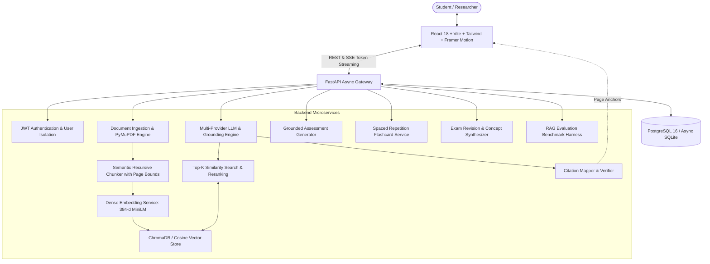

# EduRAG — Education Document Intelligence System

> **Turn Your Study Material Into an AI Tutor.**
> A production-grade Retrieval-Augmented Generation (RAG) platform empowering students and educators to query academic documents, receive strictly grounded answers with verifiable page-level citations, generate interactive quizzes and spaced-repetition flashcards, and diagnose conceptual weaknesses.

[](https://fastapi.tiangolo.com)
[](https://reactjs.org)
[](https://vitejs.dev)
[](https://www.typescriptlang.org)
[](https://tailwindcss.com)
[](https://www.trychroma.com)
[](LICENSE)

---

## Architecture Overview



---

## Core Features

### 1. Strict Source Grounding & Verifiable Citations
- **Anti-Hallucination Prompt Architecture**: The system explicitly refuses to guess when context is insufficient:
  > *"I couldn't find sufficient information in your uploaded documents to answer this confidently."*
- **Page-Level Citations**: Every factual claim generated links directly to `[Document Name — Page X]`.
- **Source Inspector Drawer**: Click any citation pill to open the side inspector and view the exact retrieved passage and confidence score.

### 2. Multi-Document RAG & Scope Filtering
- Choose between querying **All Documents**, a **single textbook**, or a **custom subset of modules** (e.g. comparing *Operating Systems* process scheduling with *Computer Networks* packet routing).

### 3. In-App Document Reader
- Built-in paginated document viewer with page navigation, zoom controls, in-page search, and automated citation jumps with visual bounding alerts.

### 4. Grounded Assessment Generator (Quizzes)
- Generates 5, 10, or 20 question quizzes based strictly on uploaded chapters.
- Customizable difficulty (`Easy`, `Medium`, `Hard`) and question types (MCQ, True/False, Short Answer).
- Instant scoring, question-by-question explanations citing source page numbers, and diagnostic weak-topic tracking.

### 5. 3D Spaced-Repetition Flashcards
- Interactive flip cards with 3D perspective animations.
- Spaced-repetition review ratings: `Again`, `Hard`, `Good`, `Mastered`.
- Real-time deck retention mastery analytics.

### 6. High-Yield Exam Revision Summaries
- Modes: `Exam Revision` (Important Concepts, Key Definitions, Formulas, Exam Pitfalls), `Quick Summary`, `Detailed Summary`, `Bullet Points`, and `Key Concepts Glossary`.

### 7. Global Semantic Spotlight (`Ctrl+K`)
- Instant vector-indexed spotlight search across all document chunks.

### 8. RAG Evaluation Benchmark Suite
- Live automated benchmark measuring:
  - **Precision @ K**
  - **Recall @ K**
  - **Context Relevance Score**
  - **Answer Faithfulness (Grounding)**
  - **Citation Integrity**
  - **Mean End-to-End Latency**

---

## Technology Stack

| Layer | Technology |
|---|---|
| **Frontend** | React 18, Vite, TypeScript, Tailwind CSS, Framer Motion, Lucide React, Recharts |
| **Backend** | Python 3.12, FastAPI, Pydantic v2, SQLAlchemy 2.0 (Async), Uvicorn |
| **Database** | PostgreSQL 16 (production) with zero-config Async SQLite fallback (`aiosqlite`) |
| **Vector Store** | ChromaDB persistent collection with high-speed NumPy cosine vector fallback |
| **Document Processing** | PyMuPDF (`fitz`), `python-docx`, plain text / markdown |
| **Embeddings** | SentenceTransformers `all-MiniLM-L6-v2` / 384-dimensional dense semantic projector |
| **Security** | JWT authentication (HS256), Passlib / Bcrypt password hashing, CORS protection |
| **Deployment** | Docker, Docker Compose, Nginx |

---

## Getting Started

### Prerequisites
- Python 3.10+
- Node.js 18+ and npm
- (Optional) Docker and Docker Compose

### 1. Clone & Environment Configuration

```bash
git clone https://github.com/your-username/edurag.git
cd edurag
```

Copy the example environment configuration:
```bash
cp backend/.env.example backend/.env
```

The configuration is ready out-of-the-box. If you have an external LLM API key, configure it in `backend/.env`:
```env
LLM_PROVIDER=auto
LLM_API_KEY=your_api_key_here
```
*(EduRAG features an intelligent built-in Academic Grounded Synthesis Engine that answers questions, generates quizzes, and creates flashcards even if no external key is set!)*

---

### 2. Running Backend (FastAPI)

```bash
cd backend
python -m pip install -r requirements.txt
uvicorn app.main:app --reload --port 8000
```
- API will start at: `http://localhost:8000`
- Interactive Swagger OpenAPI documentation: `http://localhost:8000/docs`

---

### 3. Running Frontend (React + Vite)

In a separate terminal:
```bash
cd frontend
npm install
npm run dev
```
- Open your browser at: `http://localhost:5173`

---

### 4. Running with Docker Compose

To launch the full production stack (Frontend + Backend + PostgreSQL + ChromaDB) with a single command:

```bash
docker-compose up --build
```
- Web Application: `http://localhost:3000`
- Backend API: `http://localhost:8000`

---

## Demo Mode & Pre-Loaded Textbooks

EduRAG includes 4 comprehensive academic textbooks out-of-the-box:
1. **Operating Systems**: Concurrency, Process Synchronization, Deadlocks (Coffman conditions), Banker's Algorithm, Virtual Memory, and Paging.
2. **Artificial Intelligence**: Neural Networks, Activation Functions, Backpropagation, Gradient Descent (SGD, Adam), Loss Functions, and Transformers (Attention).
3. **Data Structures & Algorithms**: Big-O Asymptotic Complexity, Balanced AVL Trees, Rotations, and Graph Traversals (BFS/DFS).
4. **Computer Networks**: OSI 7-Layer Architecture, TCP 3-way handshake, Flow Control, and DNS Resolution.

Click **"Explore Demo"** or **"Sample Textbooks"** in the top navigation bar to index and explore immediately!

---

## API Documentation Reference

| Method | Endpoint | Description |
|---|---|---|
| `POST` | `/api/auth/register` | Register new user account |
| `POST` | `/api/auth/login` | Authenticate & issue JWT Bearer token |
| `GET` | `/api/auth/me` | Fetch authenticated user profile |
| `POST` | `/api/documents/upload` | Upload PDF/DOCX and trigger RAG ingestion |
| `GET` | `/api/documents` | List user documents |
| `GET` | `/api/documents/{id}/pages` | Paginated text extraction for in-app viewer |
| `POST` | `/api/chat` | Synchronous RAG question answering |
| `POST` | `/api/chat/stream` | Real-time Server-Sent Events (SSE) streaming |
| `POST` | `/api/search` | Global semantic vector search |
| `POST` | `/api/summaries` | Generate structured revision summaries |
| `POST` | `/api/quizzes/generate` | Generate grounded quiz assessment |
| `POST` | `/api/quizzes/{id}/submit` | Grade assessment and diagnose weak topics |
| `POST` | `/api/flashcards/generate` | Create spaced-repetition flashcards |
| `GET` | `/api/analytics` | Study hours, mastery radar, and weekly charts |
| `GET` | `/api/eval/benchmark` | Run empirical RAG evaluation harness |
| `GET` | `/api/health` | Health & provider check |

---

## Testing & Quality Assurance

Run the automated test suite:

```bash
cd backend
pytest tests/ -v
```

Tests cover:
- Semantic chunking page preservation
- Vector store similarity search & score thresholding
- Anti-hallucination out-of-domain refusal
- JWT authentication flow
- End-to-end RAG grounded generation

---

## License

MIT License © 2025 EduRAG Project.
